# Cours M1 - Année 2025/2026 - Campus Bordeaux - Usage de l'IA pour les professionnels du droit 

**📖 Support de cours interactif** : https://my.beekast.com/kast/68ff8e040699c77e59abf871/presentation

---

## 📋 Notes de version du document

### Version 1.0 - 20 Octobre 2025
- Version initiale du support de cours
---

## M1 - Droit et pratique des affaires | 1er trimestre 2025/2026

**Intervenant :** Raphaël d'Assignies
**Durée totale :** 15h00

## Présentation du cours

Ce cours poursuit un double objectif pour les futurs juristes :

1. **Culture d'interface** : Développer une compréhension approfondie de l'Intelligence artificielle dans ses dimensions technique, sécuritaire et sociétale, ainsi que ses implications juridiques
2. **Compétences techniques** : Fournir les bases pour comprendre et implémenter les outils informatiques utilisés dans la pratique professionnelle quotidienne

## Structure pédagogique

- **Approche hybride** : Combinaison de présentations théoriques et d'ateliers pratiques
- **Mise en œuvre concrète** : Scripts Python, exploration de plateformes du marché, construction d'outils (GPTs, agent builder)
- **Aucun prérequis** en IA ou programmation requis

## Programme détaillé

### Module 1 : Intelligence artificielle - Concepts fondamentaux (4h00)
**Objectifs :** Maîtriser les bases de l'IA et des modèles de langage

**Contenu :**
- Histoire de l'IA depuis Dartmouth 1956
- Apprentissage machine : supervisé, non supervisé, par renforcement
- Émergence des IA génératives et cycle de vie des projets IA
- Large Language Models et traitement automatique des langues appliqué au droit

### Module 2 : Transformation des métiers du droit (3h00)
**Objectifs :** Comprendre les impacts sectoriels et identifier les nouvelles compétences

**Contenu :**
- Impacts de l'IA sur les métiers du savoir
- Transformation des professions juridiques : IA perturbatrice vs bénéfique
- Nouveaux métiers : Legal LLM engineer, IA Governance, DPO
- Hybridation des compétences : digital, gestion de projet et expertise métier

**Activité pratique :** Conception d'un parcours de formation pour les nouveaux métiers

### Module 3 : Utilisation pratique des modèles de langage (9h00)

https://github.com/rdassignies/M1_HEAD_BRDX_20252026/blob/main/genIA_etudiants_guide_pratique.md 

**Objectifs :** Maîtriser le pilotage des outils IA pour les professionnels du droit

**Contenu :**
- Cas d'usage juridiques : recherche augmentée, rédaction, extraction d'informations, analyse documentaire
- **Prompting avancé :**
  - Éléments clés : tâche, rôle, apprentissage contextuel, format de sortie
  - Approche itérative et amélioration successive
  - Prompt systems et bibliothèques de prompts
  - Capacités multimodales pour documents visuels
  - Agents autonomes et raisonnement 

## Évaluation

Les **modalités détaillées et définitives** d'évaluation seront précisées ultérieurement. 

- **Formalisation du cours** : chaque étudiant devra utiliser l’outil d’IA de son choix pour rédiger ses notes de cours au fur et à mesure. Celles-ci feront l’objet d’une évaluation comptant pour au moins 20 % de la note finale.
- 
- **QCM** : Évaluation des connaissances théoriques et pratiques
- **Cas pratiques** :
  - Extraction d'informations via modèles de langage
  - Construction de prompts pour raisonnement juridique

## Ressources complémentaires

Chaque module inclut une bibliographie avec :
- Documents de vulgarisation accessibles
- Articles de recherche académique (ICML, arXiv)
- Ressources pratiques et outils du marché
- **[Techniques de prompting avancé en matière juridique](./techniques-prompting-juridique.md)** : Exemples concrets et modèles prêts à l'emploi

### Bonnes pratiques de rédaction
- **[Fiche pratique - Rédaction professionnelle avec Word](https://github.com/rdassignies/B1-Culture-num-rique/blob/main/fiche-pratique-redaction-word.md)**
  - Guide complet pour la création de documents professionnels structurés
  - Styles hiérarchiques, typographie, pagination, citations et références
  - Conventions juridiques, accessibilité et raccourcis clavier essentiels
  - Applicable à Word, Google Docs, OpenOffice et autres traitements de texte
 
# Cas pratique : une étude du Réglement européen sur l'intelligence artificielle 
Point de départ : https://digital-strategy.ec.europa.eu/fr/policies/european-approach-artificial-intelligence 

## Exercice 1 : Qualification et Statut

Contexte : EuroAI, société allemande qui développe des modèles d'intelligence artificielle, vient de finaliser l'entraînement de son premier modèle, "Modèle Alpha".

- Calcul d'entraînement : L'entraînement a nécessité 5 x 10²³ FLOPs
- Capacités : Le modèle est capable de générer du texte de haute qualité et du code informatique
- Modèle de distribution : EuroAI prévoit de le publier sous une licence qui autorise l'accès, la modification et la distribution, mais avec la restriction suivante : gratuit pour la recherche académique, mais une licence commerciale est requise pour toute entreprise ayant plus de 100 employés
- Les poids du modèle seront publiquement accessibles

Tâche : Rédigez une note d'analyse pour le comité de direction d'EuroAI répondant aux trois questions suivantes. Votre réponse doit être entièrement justifiée en citant les articles et paragraphes pertinents des sources.
1. Le "Modèle Alpha" est-il un "modèle d'IA à usage général" (GPAI) au sens du réglement européen sur l'intelligence artificielle (RIA) ?
2. EuroAI est-elle considérée comme le "fournisseur" de ce modèle si elle le met à disposition via une API ?
3. EuroAI peut-elle bénéficier des exemptions pour les modèles open-source prévues aux articles 53(2) et 54(6) du RIA ?

## Documents nécessaires pour réaliser le cas pratique : 

https://eur-lex.europa.eu/legal-content/FR/TXT/PDF/?uri=OJ:L_202401689

https://digital-strategy.ec.europa.eu/en/library/guidelines-scope-obligations-providers-general-purpose-ai-models-under-ai-act

https://ec.europa.eu/newsroom/dae/redirection/document/118120 

https://ec.europa.eu/newsroom/dae/redirection/document/118115

https://ec.europa.eu/newsroom/dae/redirection/document/118119

## Exercice : élaborer, sur le même modèle, un exercice à partir d'un de vos cours de droit

**Consignes :**
1. Choisir un cours de droit (contrats, responsabilité civile, droit du travail, etc.)
2. Rédiger un cas pratique avec une situation factuelle détaillée
3. Identifier les sources juridiques permettant d'y répondre (codes, lois, jurisprudence)
4. Tester différentes techniques de prompting pour résoudre le cas :
   - Prompt simple (question directe)
   - Chain-of-Thought (CoT) - raisonnement pas à pas
   - Few-shot learning (avec exemples)
   - Prompt structuré avec rôle et format de sortie
5. Comparer les résultats obtenus et analyser la qualité des réponses

## Etude de quelques cas d'hallucinations dans le domaine juridique 

Merken, S. (2023, June 22). New York lawyers sanctioned for using fake ChatGPT cases in legal brief. Reuters. 

https://www.reuters.com/legal/new-york-lawyers-sanctioned-using-fake-chatgpt-cases-legal-brief-2023-06-22/

Kalai, A. T., Nachum, O., Vempala, S. S., & Zhang, E. (2025, September 4). Why language models hallucinate. OpenAI. 

https://cdn.openai.com/pdf/d04913be-3f6f-4d2b-b283-ff432ef4aaa5/why-language-models-hallucinate.pdf

Zeff, M. (2025, May 15). Anthropic’s lawyer was forced to apologize after Claude hallucinated a legal citation. TechCrunch. 

https://techcrunch.com/2025/05/15/anthropics-lawyer-was-forced-to-apologize-after-claude-hallucinated-a-legal-citation/

### Ressources essentielles pour l'analyse des LLM

#### Benchmarks et comparaisons
- **Artificial Analysis** : https://artificialanalysis.ai
  - Comparaisons de performance, coût, vitesse et qualité des LLM
  - Analyses indépendantes et mises à jour régulières

- **LMSYS Chatbot Arena** : https://chat.lmsys.org
  - Classement communautaire basé sur des comparaisons aveugles
  - Leaderboard : https://huggingface.co/spaces/lmsys/chatbot-arena-leaderboard

- **OpenLLM Leaderboard** (Hugging Face) : https://huggingface.co/spaces/open-llm-leaderboard/open_llm_leaderboard
  - Benchmarks académiques standardisés pour modèles open-source

#### Transparence et analyse des systèmes IA
- **System Prompts Leaks** : https://github.com/asgeirtj/system_prompts_leaks
  - Collection communautaire de prompts système extraits des principaux chatbots IA
  - Inclut les instructions système de ChatGPT, Claude, Gemini, Perplexity, Grok et autres
  - Ressource utile pour comprendre le fonctionnement interne et les directives des assistants IA

#### Documentation et recherche
- **Papers with Code** : https://paperswithcode.com/methods/category/language-models
  - Articles de recherche avec implémentations

- **Hugging Face** : https://huggingface.co/models
  - Plateforme de partage de modèles open-source

## Écosystème des modèles de langage (LLM)

### Grille de lecture des caractéristiques des modèles

Les modèles de langage se distinguent par plusieurs caractéristiques techniques et fonctionnelles :

#### Taille et capacité
- **Paramètres** : Nombre de paramètres du modèle (ex: 3B = 3 milliards, 70B = 70 milliards, 405B = 405 milliards)
  - Petits modèles (< 10B) : rapides, moins coûteux, performances limitées
  - Modèles moyens (10-100B) : bon équilibre performance/coût
  - Grands modèles (> 100B) : performances maximales, coûteux

#### Spécialisation
- **Usage général** : Capable de traiter une large variété de tâches (texte, analyse, raisonnement)
- **Spécialisés** :
  - **Code** : Optimisés pour la génération et l'analyse de code (ex: Codestral, GPT-4o)
  - **Vision** : Capacité multimodale image+texte (ex: GPT-4o, Claude 3.5, Gemini, Qwen-VL)
  - **Raisonnement** : Optimisés pour la réflexion complexe (ex: o1, DeepSeek-R1)

#### Fenêtre de contexte
- **Contexte court** (< 32k tokens) : Conversations et documents limités
- **Contexte long** (100k-200k tokens) : Analyse de documents étendus
- **Contexte très long** (1M+ tokens) : Base de code complète, corpus juridiques

#### Modalités
- **Texte uniquement** : Traitement de texte classique
- **Multimodal** : Texte + images, parfois audio et vidéo

#### Distribution
- **Propriétaire** : Accès uniquement via API ou interface web (ChatGPT, Claude, Gemini)
- **Open-source** : Poids du modèle téléchargeables (Llama, Mistral, Qwen)
- **Open-weight** : Poids disponibles mais formation/données non divulguées

#### Performance et coût
- **Vitesse** : Tokens générés par seconde
- **Prix** : Coût par million de tokens (input/output)
- **Qualité** : Mesurée via benchmarks (MMLU, HumanEval, etc.)

### Principaux fournisseurs et leurs modèles

#### 🇺🇸 **OpenAI** (États-Unis)
- **Modèles** : GPT-4, GPT-4o, GPT-4o mini, o1, o1-mini, GPT-3.5
- **Système** : [ChatGPT](https://chat.openai.com)
- **Site officiel** : https://openai.com

#### 🇺🇸 **Anthropic** (États-Unis)
- **Modèles** : Claude 3.5 Sonnet, Claude 3.5 Haiku, Claude 3 Opus
- **Système** : [Claude.ai](https://claude.ai)
- **Site officiel** : https://anthropic.com

#### 🇺🇸 **Google** (États-Unis)
- **Modèles** : Gemini 2.0, Gemini 1.5 Pro, Gemini 1.5 Flash
- **Système** : [Gemini](https://gemini.google.com)
- **Site officiel** : https://deepmind.google

#### 🇫🇷 **Mistral AI** (France)
- **Modèles** : Mistral Large, Mistral Medium, Mistral Small, Codestral
- **Système** : [Le Chat](https://chat.mistral.ai)
- **Site officiel** : https://mistral.ai

#### 🇺🇸 **Meta** (États-Unis)
- **Modèles** : Llama 3.3, Llama 3.2, Llama 3.1
- **Système** : Modèles open-source (pas de chatbot officiel propriétaire)
- **Site officiel** : https://llama.meta.com

#### 🇨🇳 **DeepSeek** (Chine)
- **Modèles** : DeepSeek-V3, DeepSeek-R1
- **Système** : [DeepSeek Chat](https://chat.deepseek.com)
- **Site officiel** : https://deepseek.com

#### 🇨🇳 **Alibaba** (Chine)
- **Modèles** : Qwen 2.5, Qwen-VL
- **Système** : [Qwen Chat](https://qwenlm.ai)
- **Site officiel** : https://qwenlm.ai

#### 🇺🇸 **xAI** (États-Unis)
- **Modèles** : Grok, Grok-2
- **Système** : [Grok](https://x.ai) (intégré à X/Twitter Premium)
- **Site officiel** : https://x.ai

#### 🇺🇸 **Cohere** (États-Unis/Canada)
- **Modèles** : Command R+, Command R
- **Système** : API principalement (pas de chatbot grand public)
- **Site officiel** : https://cohere.com

### Schéma de l'écosystème LLM

```mermaid
graph TB
    subgraph Amérique["🇺🇸 États-Unis"]
        OpenAI[OpenAI<br/>GPT-4, o1]
        Anthropic[Anthropic<br/>Claude 3.5]
        Google[Google DeepMind<br/>Gemini 2.0]
        Meta[Meta<br/>Llama 3.3]
        xAI[xAI<br/>Grok]
        Cohere[Cohere<br/>Command R+]
    end

    subgraph Europe["🇫🇷 Europe"]
        Mistral[Mistral AI<br/>Mistral Large]
    end

    subgraph Asie["🇨🇳 Chine"]
        DeepSeek[DeepSeek<br/>DeepSeek-V3]
        Alibaba[Alibaba<br/>Qwen 2.5]
    end

    OpenAI --> ChatGPT[ChatGPT]
    Anthropic --> Claude[Claude.ai]
    Google --> Gemini[Gemini]
    Mistral --> LeChat[Le Chat]
    DeepSeek --> DSChat[DeepSeek Chat]
    Alibaba --> QwenChat[Qwen Chat]
    xAI --> Grok[Grok sur X]

    style OpenAI fill:#10a37f
    style Anthropic fill:#d4a373
    style Google fill:#4285f4
    style Mistral fill:#f2a73b
    style Meta fill:#0668e1
    style DeepSeek fill:#1a1a1a
    style Alibaba fill:#ff6a00
    style xAI fill:#000000
```

---

*Cours conçu pour être accessible aux étudiants sans background technique, avec une approche progressive vers l'autonomie dans l'utilisation des outils IA.*

